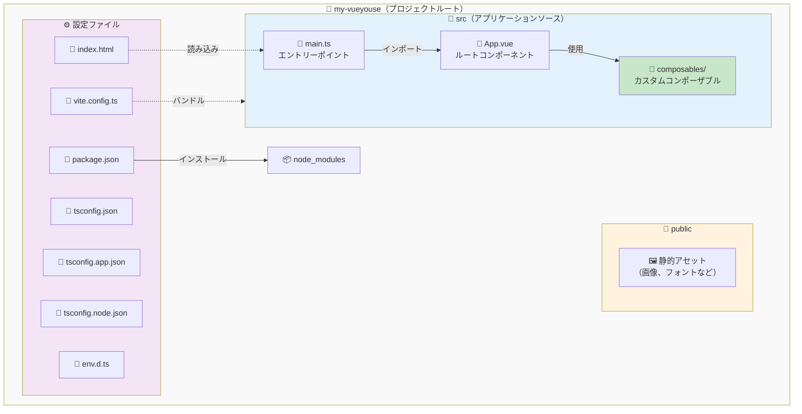

# 開発環境のセットアップ

コンポーザブルの作成に入る前に、VueYous を学ぶための適切な開発環境をセットアップしましょう。この章では、便利なセットアップツールを使う方法と、手動で環境を構築する方法の 2 つのアプローチを説明します。

## 前提条件

始める前に、以下がインストールされていることを確認してください：

- **Node.js**（v24.13.0 以上）
- **pnpm**（v10.28.2 以上）

以下のコマンドを実行してインストールを確認できます：

```bash
node --version
pnpm --version
```

### インストール方法

#### オプション 1: 直接インストール

- Node.js: [https://nodejs.org/](https://nodejs.org/)
- pnpm: [https://pnpm.io/installation](https://pnpm.io/installation)

#### オプション 2: mise を使う（バージョン管理におすすめ）

複数の Node.js や pnpm のバージョンを管理したい場合や、チーム全体で一貫したバージョンを使用したい場合は、[mise](https://mise.jdx.dev/) の使用を推奨します：

```bash
# mise をインストール（まだインストールしていない場合）
curl https://mise.run | sh

# Node.js と pnpm をグローバルにインストール
mise use -g node@24.13.0
mise use -g pnpm@10.28.2

# インストールを確認
node --version
pnpm --version
```

> [!TIP]
> `create-vueyouse` で作成したプロジェクトには `mise.toml` ファイルが含まれており、これらのバージョンが固定されています。プロジェクトに移動して以下を実行してください：
> ```bash
> mise trust  # セキュリティのため必須
> mise install
> ```

## セットアップのアプローチ

VueYous の学習環境をセットアップする方法は 2 つあります。ニーズに合った方法を選んでください。

## アプローチ 1: create-vueyouse を使う（推奨）

最も簡単に始める方法は、`create-vueyouse` ツールを使うことです。このツールは、必要なファイルと設定をすべて含む完全な学習環境をスキャフォールディングします。

### ステップ 1: プロジェクトを作成

以下のコマンドを実行します。`my-vueyouse` は任意のディレクトリ名に置き換えてください：

```bash
pnpm dlx tsx tools/create-vueyouse/main.ts my-vueyouse
```

このコマンドは以下を行います：

- 指定した名前で新しいディレクトリを作成
- 必要なテンプレートファイルをすべてコピー
- 学習用のプロジェクト構造をセットアップ

### ステップ 2: プロジェクトに移動

```bash
cd my-vueyouse
```

### ステップ 3: 依存関係をインストール

> [!IMPORTANT]
> mise を使用している場合は、依存関係をインストールする前に `mise trust` を実行してバージョン管理を有効にしてください。

```bash
pnpm install
```

### ステップ 4: 開発サーバーを起動

```bash
pnpm run dev
```

開発サーバーが `http://localhost:5173` で起動するはずです。ブラウザでこの URL を開けば、学習を始める準備が整いました！

## アプローチ 2: 手動セットアップ

セットアップの各部分を理解したい場合や、ゼロから環境をカスタマイズしたい場合は、以下の手順に従ってください：

### ステップ 1: プロジェクトディレクトリを作成

```bash
mkdir my-vueyouse
cd my-vueyouse
```

### ステップ 2: パッケージマネージャーを初期化

```bash
pnpm init
```

### ステップ 3: コア依存関係をインストール

```bash
pnpm add vue@^3.5.0
pnpm add -D vite @vitejs/plugin-vue typescript vue-tsc
```

### ステップ 4: 型定義をインストール

```bash
pnpm add -D @types/node @tsconfig/node24 @vue/tsconfig
```

### ステップ 5: 設定ファイルを作成

プロジェクトルートに以下のファイルを作成します：

**`tsconfig.json`**:

```json
{
  "files": [],
  "references": [{ "path": "./tsconfig.node.json" }, { "path": "./tsconfig.app.json" }]
}
```

**`tsconfig.app.json`**:

```json
{
  "extends": "@vue/tsconfig/tsconfig.dom.json",
  "include": ["env.d.ts", "src/**/*", "src/**/*.vue"],
  "exclude": ["src/**/__tests__/*"],
  "compilerOptions": {
    "composite": true,
    "tsBuildInfoFile": "./node_modules/.tmp/tsconfig.app.tsbuildinfo",
    "baseUrl": ".",
    "paths": {
      "@/*": ["./src/*"]
    }
  }
}
```

**`tsconfig.node.json`**:

```json
{
  "extends": "@tsconfig/node24/tsconfig.json",
  "include": [
    "vite.config.*",
    "vitest.config.*",
    "cypress.config.*",
    "nightwatch.conf.*",
    "playwright.config.*"
  ],
  "compilerOptions": {
    "composite": true,
    "noEmit": true,
    "tsBuildInfoFile": "./node_modules/.tmp/tsconfig.node.tsbuildinfo",
    "module": "ESNext",
    "moduleResolution": "Bundler",
    "types": ["node"]
  }
}
```

**`vite.config.ts`**:

```typescript
import { fileURLToPath, URL } from "node:url";
import { defineConfig } from "vite";
import vue from "@vitejs/plugin-vue";

export default defineConfig({
  plugins: [vue()],
  resolve: {
    alias: {
      "@": fileURLToPath(new URL("./src", import.meta.url)),
    },
  },
});
```

**`env.d.ts`**:

```typescript
/// <reference types="vite/client" />
```

### ステップ 6: プロジェクト構造を作成

以下のディレクトリ構造を作成します：

```
my-vueyouse/
├── packages/             # コンポーザブルライブラリ
│   └── index.ts
└── examples/             # テスト用playground（オプション）
    └── playground/
```

### ステップ 7: 最初のコンポーザブルを作成

`packages/index.ts` を作成します：

```typescript
export function HelloVueYous() {
  // eslint-disable-next-line no-console
  console.log("Hello VueYous!");
}
```

これが出発点です。学習を進めるにつれて、このファイルにコンポーザブルを追加してエクスポートしていきます。

> [!TIP]
> `packages/` ディレクトリは、VueUse スタイルのコンポーザブルを構築する場所です。作成した各コンポーザブルは `index.ts` からエクスポートされます。

### ステップ 8: package.json にスクリプトを追加

`package.json` を更新して、以下のスクリプトを含めます：

```json
{
  "scripts": {
    "dev": "vite",
    "build": "vue-tsc && vite build",
    "preview": "vite preview"
  }
}
```

### ステップ 9: 開発サーバーを起動

```bash
pnpm run dev
```

## プロジェクト構造の概要

どちらのアプローチを選んでも、プロジェクト構造は以下のようになります：

```
my-vueyouse/
├── src/
│   ├── composables/      # VueUse にインスパイアされたコンポーザブル
│   ├── App.vue           # メインアプリケーションコンポーネント
│   └── main.ts           # アプリケーションエントリーポイント
├── public/               # 静的アセット
├── node_modules/         # 依存関係
├── index.html            # HTML テンプレート
├── package.json          # パッケージ設定
├── tsconfig.json         # TypeScript 設定
├── tsconfig.app.json     # アプリ固有の TS 設定
├── tsconfig.node.json    # Node 固有の TS 設定
├── vite.config.ts        # Vite 設定
└── env.d.ts              # 型定義
```

### ビジュアル概要

ファイルとディレクトリの関係は以下の通りです：



### 主要なディレクトリ

- **`src/composables/`**: この本を進めながら、カスタムコンポーザブルを作成する場所
- **`src/App.vue`**: コンポーザブルをテストするためのプレイグラウンド
- **`public/`**: 処理が不要な静的ファイル

## セットアップの確認

すべてが正しく動作しているか確認するには：

1. 開発サーバーが起動していることを確認（`pnpm run dev`）
2. ブラウザで `http://localhost:5173` を開く
3. ブラウザの開発者コンソールを開く（F12 または右クリック → 検証 → Console タブ）
4. コンソールに **"Hello VueYous!"** が表示されていることを確認
5. `src/App.vue` を編集して保存してみてください - 変更がすぐに反映されます（ホットモジュールリプレースメント）

> [!TIP]
> コンソールに "Hello VueYous!" が表示されていれば、おめでとうございます！環境が正しくセットアップされ、学習の準備が整いました。

## 次のステップ

おめでとうございます！開発環境の準備が整いました。

次のセクションでは、最初のコンポーザブルを作成し、VueUse のコンポーザブルがどのように内部で動作するかを理解していきます。

## トラブルシューティング

### ポートがすでに使用されている

ポート 5173 がすでに使用されているというエラーが表示された場合：

```bash
# ポートを使用しているプロセスを終了
npx kill-port 5173

# または別のポートを指定
pnpm run dev -- --port 3000
```

### モジュール解決の問題

モジュール解決エラーが発生した場合：

1. `node_modules` を削除して再インストール：
   ```bash
   rm -rf node_modules
   pnpm install
   ```
2. Vite のキャッシュをクリア：
   ```bash
   rm -rf node_modules/.vite
   ```

### TypeScript エラー

エディタで TypeScript エラーが表示される場合：

1. TypeScript サーバーを再起動（VS Code の場合：`Cmd/Ctrl + Shift + P` → 「TypeScript: Restart TS Server」）
2. Vue Language Features (Volar) 拡張機能がインストールされていることを確認（Vetur ではありません）

---

コンポーザブルの構築を始める準備はできましたか？コンポーザブルとは何か、なぜ強力なのかを理解していきましょう！
