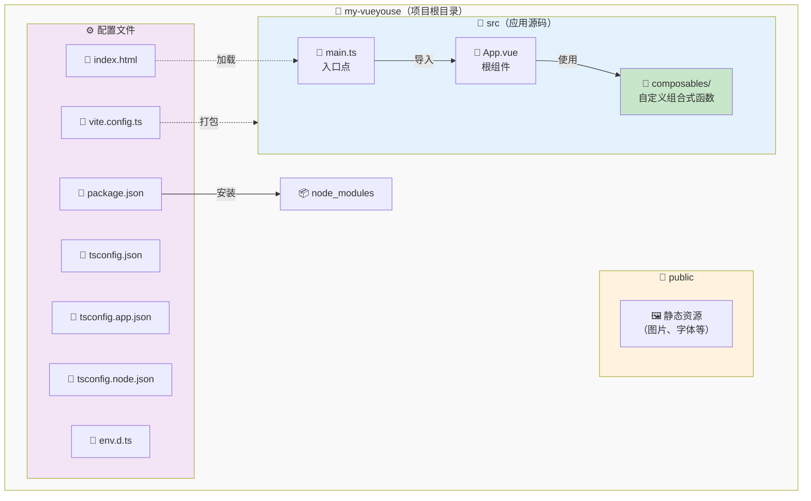

# 设置开发环境

在开始创建组合式函数之前，让我们先为学习 VueYous 设置一个合适的开发环境。本章将介绍两种方法：使用我们提供的便捷设置工具或手动配置环境。

## 前置条件

开始之前，请确保已安装以下工具：

- **Node.js**（v24.13.0 或更高版本）
- **pnpm**（v10.28.2 或更高版本）

您可以通过运行以下命令来验证安装：

```bash
node --version
pnpm --version
```

### 安装选项

#### 选项 1：直接安装

- Node.js: [https://nodejs.org/](https://nodejs.org/)
- pnpm: [https://pnpm.io/installation](https://pnpm.io/installation)

#### 选项 2：使用 mise（推荐用于版本管理）

如果您想管理多个 Node.js 和 pnpm 版本，或确保团队使用一致的版本，我们推荐使用 [mise](https://mise.jdx.dev/)：

```bash
# 安装 mise（如果尚未安装）
curl https://mise.run | sh

# 全局安装 Node.js 和 pnpm
mise use -g node@24.13.0
mise use -g pnpm@10.28.2

# 验证安装
node --version
pnpm --version
```

> [!TIP]
> 使用 `create-vueyouse` 创建的项目包含 `mise.toml` 文件，锁定了这些版本。进入项目后运行：
> ```bash
> mise trust  # 出于安全考虑必需
> mise install
> ```

## 设置方法

有两种方法来设置您的 VueYous 学习环境。选择适合您需求的方法。

## 方法 1: 使用 create-vueyouse（推荐）

最简单的入门方法是使用我们的 `create-vueyouse` 工具。该工具会为您搭建一个包含所有必要文件和配置的完整学习环境。

### 步骤 1: 创建项目

运行以下命令，将 `my-vueyouse` 替换为您喜欢的目录名：

```bash
pnpm dlx tsx tools/create-vueyouse/main.ts my-vueyouse
```

此命令将：

- 使用您指定的名称创建新目录
- 复制所有必要的模板文件
- 设置用于学习的项目结构

### 步骤 2: 进入项目目录

```bash
cd my-vueyouse
```

### 步骤 3: 安装依赖

> [!IMPORTANT]
> 如果使用 mise，请在安装依赖前运行 `mise trust` 以启用版本管理。

```bash
pnpm install
```

### 步骤 4: 启动开发服务器

```bash
pnpm run dev
```

您的开发服务器现在应该在 `http://localhost:5173` 运行。在浏览器中打开此 URL，您就可以开始学习了！

## 方法 2: 手动设置

如果您希望了解设置的每个部分或想从头开始自定义环境，请按照以下步骤操作：

### 步骤 1: 创建项目目录

```bash
mkdir my-vueyouse
cd my-vueyouse
```

### 步骤 2: 初始化包管理器

```bash
pnpm init
```

### 步骤 3: 安装核心依赖

```bash
pnpm add vue@^3.5.0
pnpm add -D vite @vitejs/plugin-vue typescript vue-tsc
```

### 步骤 4: 安装类型定义

```bash
pnpm add -D @types/node @tsconfig/node24 @vue/tsconfig
```

### 步骤 5: 创建配置文件

在项目根目录中创建以下文件：

**`tsconfig.json`**:

```json
{
  "files": [],
  "references": [{ "path": "./tsconfig.node.json" }, { "path": "./tsconfig.app.json" }]
}
```

**`tsconfig.app.json`**:

```json
{
  "extends": "@vue/tsconfig/tsconfig.dom.json",
  "include": ["env.d.ts", "src/**/*", "src/**/*.vue"],
  "exclude": ["src/**/__tests__/*"],
  "compilerOptions": {
    "composite": true,
    "tsBuildInfoFile": "./node_modules/.tmp/tsconfig.app.tsbuildinfo",
    "baseUrl": ".",
    "paths": {
      "@/*": ["./src/*"]
    }
  }
}
```

**`tsconfig.node.json`**:

```json
{
  "extends": "@tsconfig/node24/tsconfig.json",
  "include": [
    "vite.config.*",
    "vitest.config.*",
    "cypress.config.*",
    "nightwatch.conf.*",
    "playwright.config.*"
  ],
  "compilerOptions": {
    "composite": true,
    "noEmit": true,
    "tsBuildInfoFile": "./node_modules/.tmp/tsconfig.node.tsbuildinfo",
    "module": "ESNext",
    "moduleResolution": "Bundler",
    "types": ["node"]
  }
}
```

**`vite.config.ts`**:

```typescript
import { fileURLToPath, URL } from "node:url";
import { defineConfig } from "vite";
import vue from "@vitejs/plugin-vue";

export default defineConfig({
  plugins: [vue()],
  resolve: {
    alias: {
      "@": fileURLToPath(new URL("./src", import.meta.url)),
    },
  },
});
```

**`env.d.ts`**:

```typescript
/// <reference types="vite/client" />
```

### 步骤 6: 创建项目结构

创建以下目录结构：

```
my-vueyouse/
├── packages/             # 组合式函数库
│   └── index.ts
└── examples/             # 测试 playground（可选）
    └── playground/
```

### 步骤 7: 创建第一个组合式函数

创建 `packages/index.ts`：

```typescript
export function HelloVueYous() {
  // eslint-disable-next-line no-console
  console.log("Hello VueYous!");
}
```

这是您的起点。随着学习的深入，您将向此文件添加更多组合式函数并导出它们。

> [!TIP]
> `packages/` 目录是您构建 VueUse 风格组合式函数的地方。您创建的每个组合式函数都将从 `index.ts` 导出。

### 步骤 8: 向 package.json 添加脚本

更新您的 `package.json` 以包含这些脚本：

```json
{
  "scripts": {
    "dev": "vite",
    "build": "vue-tsc && vite build",
    "preview": "vite preview"
  }
}
```

### 步骤 9: 启动开发服务器

```bash
pnpm run dev
```

## 项目结构概述

无论您选择哪种方法，您的项目结构应该如下所示：

```
my-vueyouse/
├── src/
│   ├── composables/      # 受 VueUse 启发的组合式函数
│   ├── App.vue           # 主应用组件
│   └── main.ts           # 应用入口点
├── public/               # 静态资源
├── node_modules/         # 依赖项
├── index.html            # HTML 模板
├── package.json          # 包配置
├── tsconfig.json         # TypeScript 配置
├── tsconfig.app.json     # 应用特定的 TS 配置
├── tsconfig.node.json    # Node 特定的 TS 配置
├── vite.config.ts        # Vite 配置
└── env.d.ts              # 类型定义
```

### 可视化概述

以下是文件和目录之间的关系：



### 关键目录

- **`src/composables/`**: 在阅读本书时创建自定义组合式函数的位置
- **`src/App.vue`**: 测试组合式函数的游乐场
- **`public/`**: 不需要处理的静态文件

## 验证您的设置

要验证一切是否正常工作：

1. 确保开发服务器正在运行（`pnpm run dev`）
2. 在浏览器中打开 `http://localhost:5173`
3. 打开浏览器的开发者控制台（F12 或右键 → 检查 → Console 标签）
4. 您应该在控制台中看到 **"Hello VueYous!"**
5. 尝试编辑 `src/App.vue` 并保存 - 您应该立即看到更改（热模块替换）

> [!TIP]
> 如果在控制台中看到 "Hello VueYous!"，恭喜！您的环境已正确设置，可以开始学习了。

## 下一步

恭喜！您的开发环境现已准备就绪。

在下一节中，我们将开始创建第一个组合式函数，并了解 VueUse 组合式函数的内部工作原理。

## 故障排除

### 端口已被占用

如果您看到端口 5173 已被使用的错误：

```bash
# 终止使用该端口的进程
npx kill-port 5173

# 或指定不同的端口
pnpm run dev -- --port 3000
```

### 模块解析问题

如果遇到模块解析错误：

1. 删除 `node_modules` 并重新安装：
   ```bash
   rm -rf node_modules
   pnpm install
   ```
2. 清除 Vite 缓存：
   ```bash
   rm -rf node_modules/.vite
   ```

### TypeScript 错误

如果在编辑器中看到 TypeScript 错误：

1. 重启 TypeScript 服务器（在 VS Code 中：`Cmd/Ctrl + Shift + P` → "TypeScript: Restart TS Server"）
2. 确保已安装 Vue Language Features (Volar) 扩展（而不是 Vetur）

---

准备好开始构建组合式函数了吗？让我们继续了解什么是组合式函数以及它们为何如此强大！
